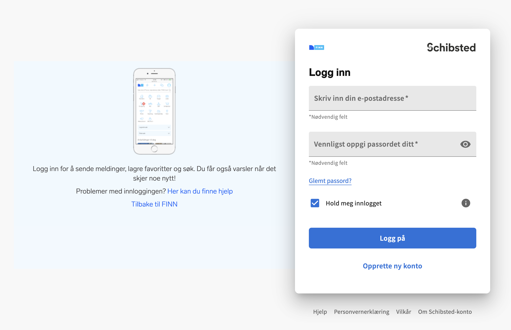

# IDG1293-2024-oblig2

This document contains the description and starter code for `oblig1: IDG1293 SPRING-2024`.

# Goal

* Prove your understanding of `BEM`.
* Show that you can read documentation from an existing `Desing System` and implement some of their components at a foundational level.
* Demonstrate you can work in a collaborative way using github.
* Show you can deploy a simple website in Github pages for demo purposes only (check [github-pages.pdf](./misc/github-pages.pdf) under `misc` folder).

# Introduction

**Scenario**

**Finn.no** AS is a Norwegian online marketplace that facilitates various types of advertisements and services for both private individuals and businesses.
The UX/UI team has recently crafted a new `Design System` for the company. You can find the comprehensive documentation for this system at [Fabric Design System](https://www.fabric-ds.io/).

Before developing the whole system and officially launching it, they intend to conduct user testing on some of its components first. As part of this effort, they’ve hired your team to develop specific components.
Your employer has specified that all the code must be implemented using the following two methodologies:
1.	**BEM (Block Element Modifier)**: A popular naming convention for writing modular and maintainable CSS.
2.	**SASS (Syntactically Awesome Style Sheets)**: A powerful preprocessor for CSS that enhances its capabilities.

**About Components in the existing design system**

The current design system is in beta. As such, it serves as a valuable source of inspiration and helps ensure comprehensive coverage of all design aspects. Before diving into code implementation, explore the [“Foundations”](https://www.fabric-ds.io/typography) section, which covers Typography, Color, Iconography, and more.

In the documentation, you may notice that certain components lack information in the “Design Tab.” If this occurs, check whether the element is detailed in other tabs. For instance, the `Button` component is thoroughly documented in the Design tab. However, the `Card` section only provides links to React or Vue implementations.

# Context

In this "oblig" you will be presented with a brief description of the problem you have to solve. Have in mind the [Goal section](#goal) when you design and implement your assignment. 

This is a group task, and you are required to build everything from the ground up. Although, you may utilize snippets of code from tutorials or official documentation, you must clearly acknowledge the sources in the comments of your code. Plagiarism or cheating will be deemed to have taken place if the submitted code shows substantial similarities to other students' assignments or projects found online. In such cases, the matter will be reported to the NTNU appeals committee for further examination. If you have any doubts regarding the use of materials for your project, please reach out to the instructor for clarification. 

It is imperative to deliver the assignment within the set deadline (never after).

## Task

1. Observe and identify the main components of the design system by looking the screenshots [screenshot1.png](./misc/screenshot1.png) and [screenshot2.png](./misc/screenshot2.png) that you can find under the `misc` folder (picture below). Then, draw on top of the screenshots and mark the main components you identify. Give a name to the component. Store the new images under the `documents`folder.
 The members of the group must work together with this task.

_Screenshot 1_

_Screenshot 2_

2. In addition to the components you have identified in the previous step, pay special attention to `buttons`, `inputs`and `cards` since these will be the ones we will closely inspect during the grading. Open [Finn.no](https://www.finn.no/) as well as the "Log in" page and inspect all the elments, hover the buttons, play with the form controls and carefully observe how the styles are "modified" based on different status. Check the [Fabric Design System](https://www.fabric-ds.io/) for additional information.
    * Divide the elments between the members of the group. All the `BEM`code for the components you have identified from the design system must be coded in `assets/styles/common.scss`.
    * Both members of the group must work editing the same file. Therefore, create a branch for each member of the group and merge the other's changes into your branch when you need to update the pages.

3. Each member of the group will be in charge of implementing one of the pages. This is, `page-screenshot1.html` and `page-screenshot2.html`

4. Implement the `demo.html` file to display all your components separety and, for each component, show the different status (with their modifiers).

5. Merge all the branches to the main branch and make sure all the code is pushed to the repo before the deadline.

# Folder structure

* `demo.html`contains examples for each one of the components you have implemented from the design system. Each component will show all their status.

* `misc/` screenshots and other files that may be useful to understand the assignment

* `documents/` use this folder to document everything you do. Write your process and explanations in the `report.md` file.

* `assets/styles/common.scss` use this file to implement all the CSS rules connected to the components of your design system

* `assets/styles/style.scss` use this file to implement all the CSS rules you need for `page-screenshot1.html`and `page-screenshot2.html`. This file will contain the specific rules for these two pages (layout, background color, etc.)

# Delivery

This assignment must be delivered in two different places: GitHub classroom and Blackboard.

* To deliver the assignment in GitHub Classroom, you only need to make sure all your changes and commits are pushed to your Git repository.
    * A Pull request is created automatically when the repository is cloned. Feedback will be included there if needed. Do not remove or close that Pull Request.
    * Only the changes in the "main" branch will be considered the final version. Do not close the other branches since we will look how you have collaborated using Git.

* It is imperative that you work exclusively with this Git repository to ensure that all modifications are trackable and your code is backed up on a regular basis. Hence, you should commit your progress directly to this repository each time you make advancements.

* Before delivering the assignment in Blackboard, make sure your project has all the files it needs. Delete any file, folder or info that is not needed (e.g.: `.git/` folder). Zip the project and upload the file to Blackboard. 